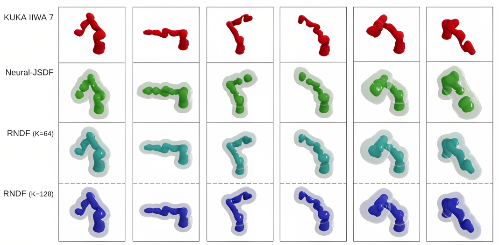

[**Differentiable Robot Neural Distance Function for Adaptive Grasp Synthesis on a Unified Robotic Arm-Hand System**](https://adaptive-grasping.github.io/)

[Yiting Chen](https://scholar.google.de/citations?user=Hx2howwAAAAJ&hl=en), [Xiao Gao](https://scholar.google.de/citations?user=AzioDCYAAAAJ&hl=en)†, [Kunpeng Yao](https://scholar.google.de/citations?user=YN1iXY4AAAAJ&hl=en)†, [Loïc Niederhauser](https://people.epfl.ch/loic.niederhauser?lang=en), [Yasemin Bekiroglu](https://yaseminb.github.io/), [Aude Billard](https://scholar.google.com.hk/citations?user=tM4JMcQAAAAJ&hl=zh-CN&oi=ao)

† Equal correspondence.


##### The code and model will be open sourced upon acceptance.


### Robot Neural Distance Function (RNDF)

We construct the Signed Distance Function (SDF) within multi-link articulated robot's *joint space*.  Given arbitrary robot configuration **q** = [q1,..., qm] and arbitrary query point **p**=[x, y, z] with its workspace, our RNDF estimates the signed distances **d**=[d1, ..., dn] between query point **p** and robot's n links' surface with high precision (with Avg. error of 0.0015m). RNDF supports parallel computation and is differentiable.


Visualizations of ground truth robot mesh and isosurfaces with minimum predicted value=0.001m (solid) and value=0.1m (transparent).




#### If you find our work useful, please consider citing:

```
@article{chen2023differentiable,
  title={Differentiable Robot Neural Distance Function for Adaptive Grasp Synthesis on a Unified Robotic Arm-Hand System},
  author={Chen, Yiting and Gao, Xiao and Yao, Kunpeng and Niederhauser, Lo{\"\i}c and Bekiroglu, Yasemin and Billard, Aude},
  journal={arXiv preprint arXiv:2309.16085},
  year={2023}
}
```


##### Relative Publications:

Neural-JSDF: [Neural joint space implicit signed distance functions for reactive robot manipulator control](https://ieeexplore.ieee.org/abstract/document/9976191/)
